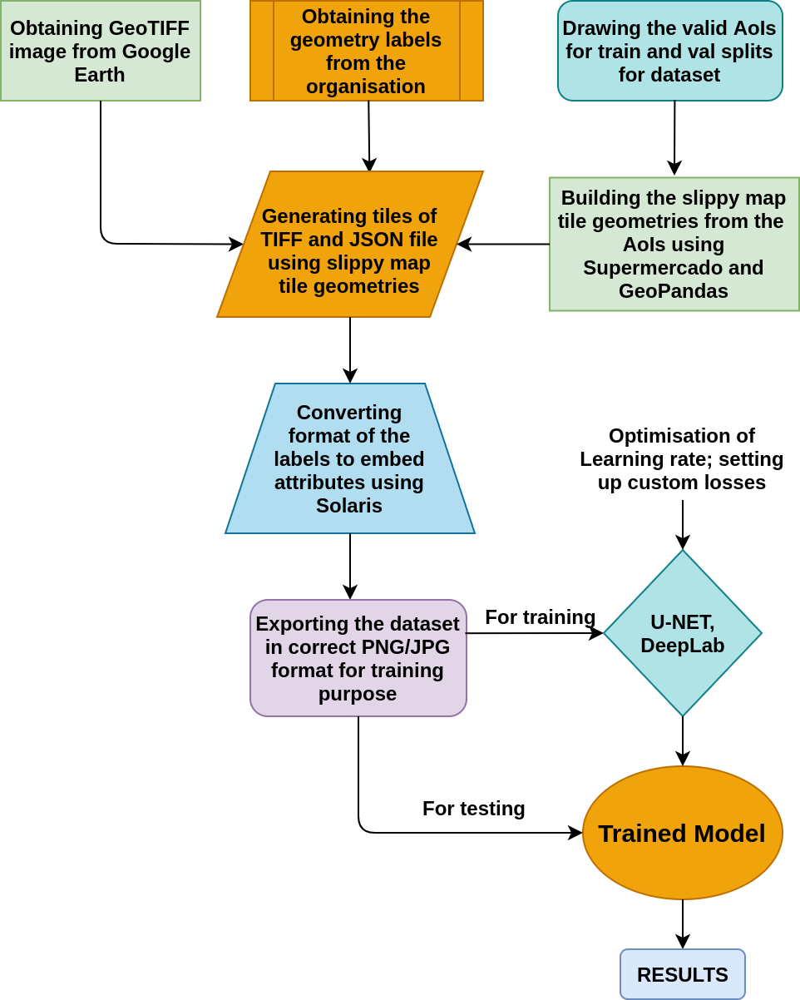
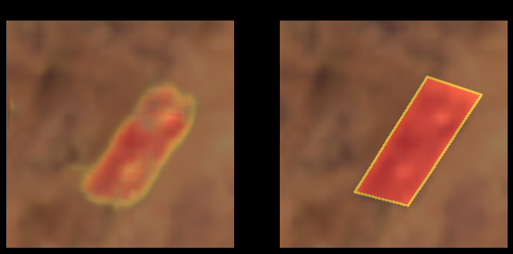
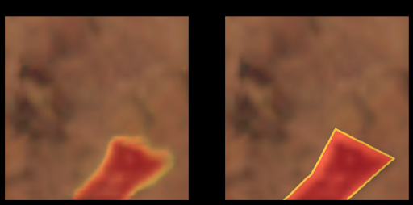
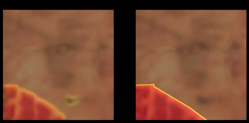
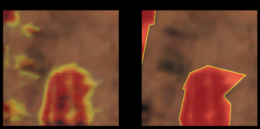
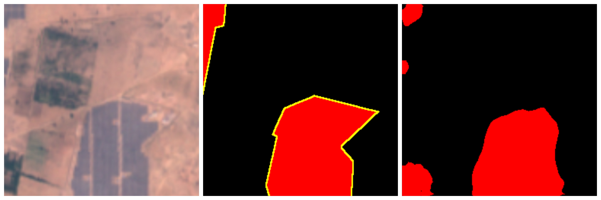
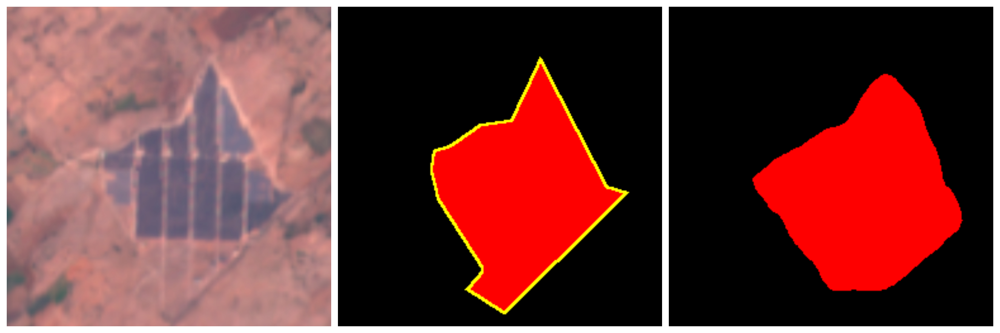
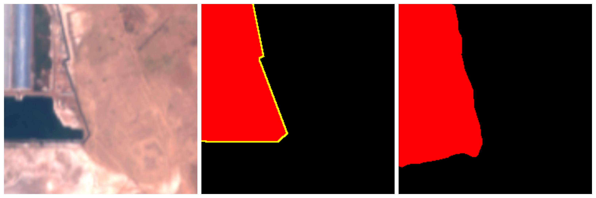

# Semantic Segmentation on GeoSpatial Imagery

## Introduction

This repository consists of a summary of my research based project work at **Regional Remote Sensing Centre (NRSC, ISRO) 2020**. The objective of the project was to perform Semantic Segmentation on GeoSpatial Imagery to detect House Buildings, Solar Farms and Sand Dunes in Rajasthan. The project aimed at promoting autonomous detection of target objects so that they can be precisely tracked, monitored, and serve as a key indicator in managing disasters as well as promoting sustainable growth.

## Platforms, Libraries & Frameworks Used

1. Google Earth Engine
2. Google Colaboratory
3. Geojson.io
4. Geo-Processing Tools: GeoPandas, Rasterio, Supermercado, Rio-Tiler, Solaris
5. Augmentor
6. UNet (FastAI)
7. DeepLab V3+ (TensorFlow 1)

## Core Workflow

## Results 
### UNet on LANDSAT Imagery

### DeepLab V3+ on SENTINEL Imagery

## References
1. [Segmenting Buildings on Drone Imagery](https://medium.com/@anthropoco/how-to-segment-buildings-on-drone-imagery-with-fast-ai-cloud-native-geodata-tools-ae249612c321)
2. [DeepLab V3+](https://github.com/tensorflow/models/tree/master/research/deeplab)
3. [DeepLab on Custom Dataset](http://hellodfan.com/2018/07/06/DeepLabv3-with-own-dataset/)
3. [Google Earth Engine Documentation](https://developers.google.com/earth-engine)
4. [GEE Tutorials](https://www.youtube.com/watch?v=W2V_awzKDOg&list=PLivRXhCUgrZpCR3iSByLYdd_VwFv-3mfs)

